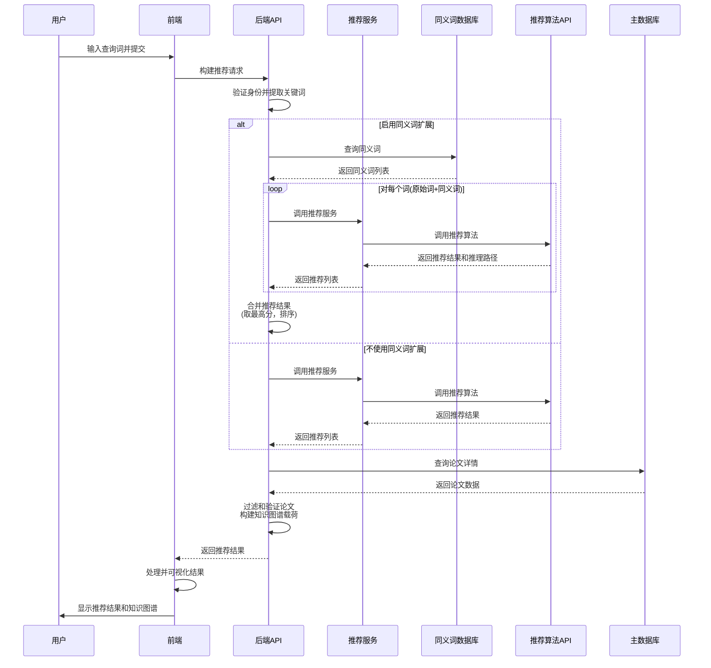

```mermaid
sequenceDiagram
    participant User as 用户
    participant Frontend as 前端
    participant Backend as 后端API
    participant Service as 推荐服务
    participant SynonymDB as 同义词数据库
    participant RecAPI as 推荐算法API
    participant MainDB as 主数据库

    User->>Frontend: 输入查询词并提交
    
    Frontend->>Backend: 构建推荐请求
    
    Backend->>Backend: 验证身份并提取关键词
    
    alt 启用同义词扩展
        Backend->>SynonymDB: 查询同义词
        SynonymDB-->>Backend: 返回同义词列表
        
        loop 对每个词(原始词+同义词)
            Backend->>Service: 调用推荐服务
            Service->>RecAPI: 调用推荐算法
            RecAPI-->>Service: 返回推荐结果和推理路径
            Service-->>Backend: 返回推荐列表
        end
        
        Backend->>Backend: 合并推荐结果<br/>(取最高分，排序)
    else 不使用同义词扩展
        Backend->>Service: 调用推荐服务
        Service->>RecAPI: 调用推荐算法
        RecAPI-->>Service: 返回推荐结果
        Service-->>Backend: 返回推荐列表
    end
    
    Backend->>MainDB: 查询论文详情
    MainDB-->>Backend: 返回论文数据
    
    Backend->>Backend: 过滤和验证论文<br/>构建知识图谱载荷
    
    Backend-->>Frontend: 返回推荐结果
    
    Frontend->>Frontend: 处理并可视化结果
    
    Frontend->>User: 显示推荐结果和知识图谱
```